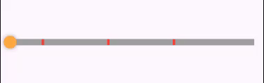

<!--
This README describes the package. If you publish this package to pub.dev,
this README's contents appear on the landing page for your package.

For information about how to write a good package README, see the guide for
[writing package pages](https://dart.dev/tools/pub/writing-package-pages).

For general information about developing packages, see the Dart guide for
[creating packages](https://dart.dev/guides/libraries/create-packages)
and the Flutter guide for
[developing packages and plugins](https://flutter.dev/to/develop-packages).
-->

# Progress Bar Marked

This is a navigation bar where you can specify specific times in this navigation bar.



**You can use it for video and audio.**

# Example

```dart
ProgressBarMarked(
    activeColor: Colors.orange,
    markColor: Colors.red,
    thumbColor: Colors.orangeAccent,
    strokeHeight: 10,
    duration: _controller.value.duration,
    position: _controller.value.position,
    markers: [
        Duration(seconds: 1),
        Duration(seconds: 2),
        Duration(seconds: 15),
    ],
    onUpdate: (duration) {
        _controller.seekTo(duration);
        setState(() {});
    },
    onUpdateStart: () {},
    onUpdateEnd: () {},
),
```
